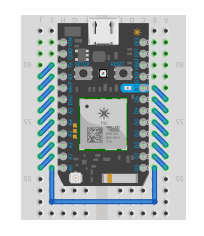

particle-photon-testing-curcuit
####################

Making a Particle-Photon-Testing breadboard and perhaps a PCB to go along with it.

Update June 10th, 2017

The photon -Alone.ino is ready to go. Steps through every Photon GPIO pin and tests it against the neighboring pin or DAC pin. I hope to make aPCB board but if you can't wait you can wire up the breadboard below.

Note: Use at your own risk, presently this software runs with a fully working Photon, no idea what it will do with a photon with a broken GPIO pin!

...

Update June 4, 2017

Now working on AnalogWrite PWM to an analogRead using an LED and photoresitor. Will need to think through the fuzzy logic to be able to test if it is working since light levels may be different using diffrerent LED's

Got DACs working set DAC variable voltage to analogReads to test 3 levels 1000, 2000, 3000 with a little fuzzy logic to see if they were correct.

Started Jun 2, 2017

Got digital input and outputs all working byu connecting every pin together and setting all of them to inputs until one at a time set to output.
