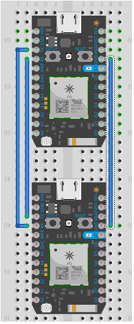
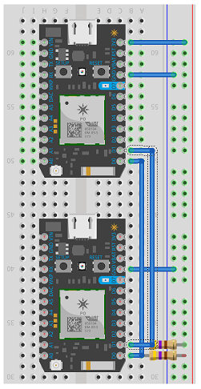
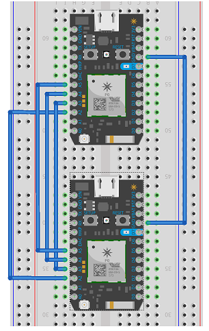

Testing area for individual serial communication between two photons

Update Jun10, 2017

Need to tweak most files, I2C working, UART not sperated yet. SPI not yet working.

For all images assume the Master is on top and the slave below, but from a connection point of view it does not matter (I think :>).

uART  (RX-TX, GND)  Serial  Communication Breadboard Diagram
Note: For uART only Rx connects to TX and Tx connects to RX

I2C (D0, D1 with Pullups, GND) Serial  Communication Breadboard Diagram

SPI (A2-A5, GND) Serial Communication Breadboard Diagram

